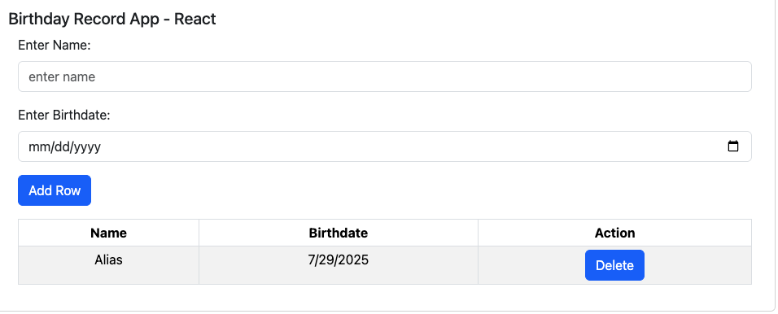
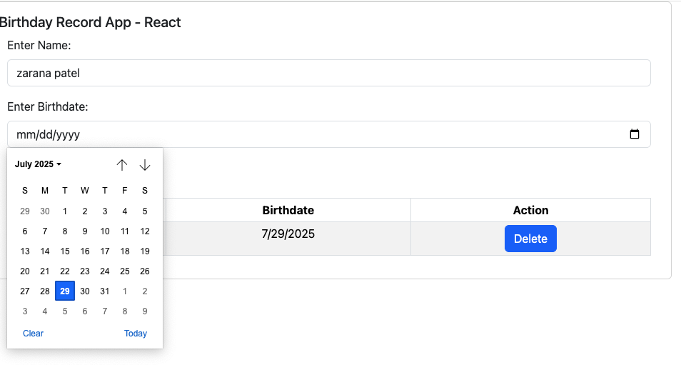
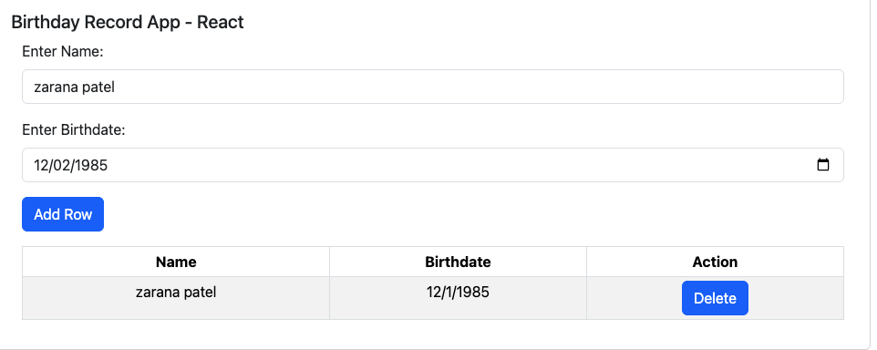

# 🎂 Birthday Record App – React

## 📌 Description

This is a **simple ReactJS** application that lets users **add, view, and delete birthday records**.

The project demonstrates:

- 📋 Creating dynamic table components (Add/Delete)
- 🔄 Parent-child component communication
- 💅 Styling using **React Bootstrap**
- 💾 Local state-based data management (can be extended to `localStorage`, `sessionStorage`, or backend APIs)

---

## 🚀 Live Demo

👉 [View Live Demo on GitHub Pages](https://zarana-patel.github.io/birthdayrecords-reactjs-app/)

---

## 🖼️ App Screenshots

### Form and Table Layout



### Date Picker in Action



### Record Added Successfully



> 💡 Store your screenshots in an `assets/` folder inside your project directory.

---

## 🛠 Prerequisites

- Node.js
- npm
- Basic React knowledge
- React Bootstrap

Install the React app tool globally if needed:

```bash
npm install -g create-react-app
```

---

## 📥 Clone and Run Locally

Follow these steps to run the app on your local machine:

1. **Clone the Repository**:

```bash
git clone https://github.com/your-username/birthdayrecords-reactjs-app.git
cd birthdayrecords-reactjs-app
```

2. **Install Dependencies**:

```bash
npm install
```

3. **Start the Development Server**:

```bash
npm start
```

This will launch the app in your browser at 👉 `http://localhost:3000`

---

## 🧩 Components

- `App.js`: Root component that maintains state and handles record list updates.
- `RecordForm.js`: Form to input name and birthday date.
- `RecordTable.js`: Displays the list of records in a table.
- `RecordRow.js`: Represents each individual record row with a delete option.

---

## 📚 Resources

- [React Documentation](https://reactjs.org/)
- [React Bootstrap Docs](https://react-bootstrap.github.io/)
- [React Date Picker](https://reactdatepicker.com/)
- [Create React App Guide](https://github.com/facebook/create-react-app)
- [GitHub Pages Deployment](https://create-react-app.dev/docs/deployment/#github-pages)

---
